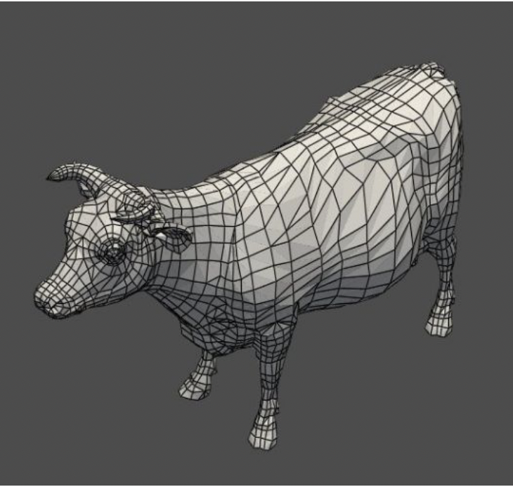
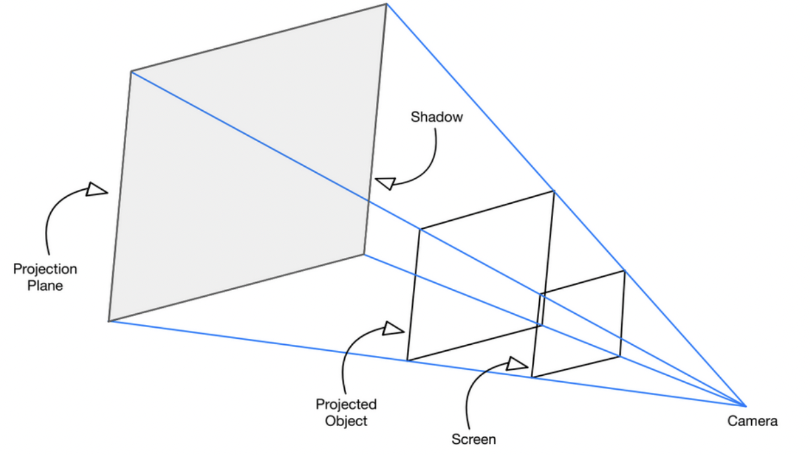
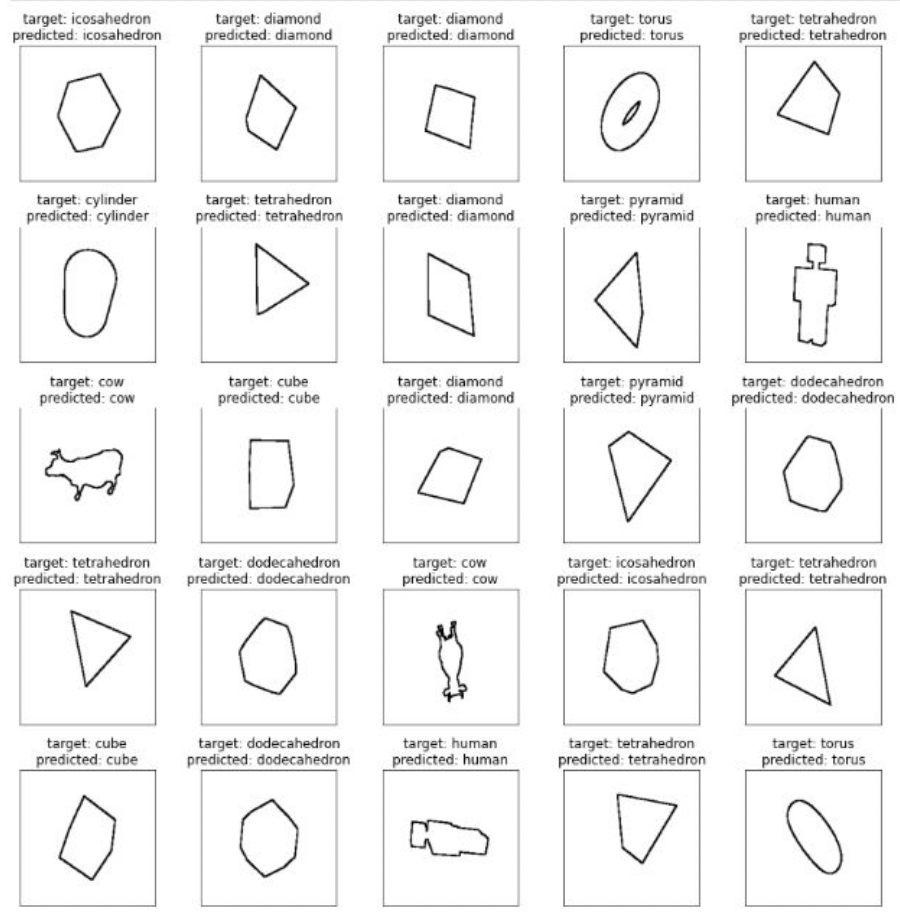
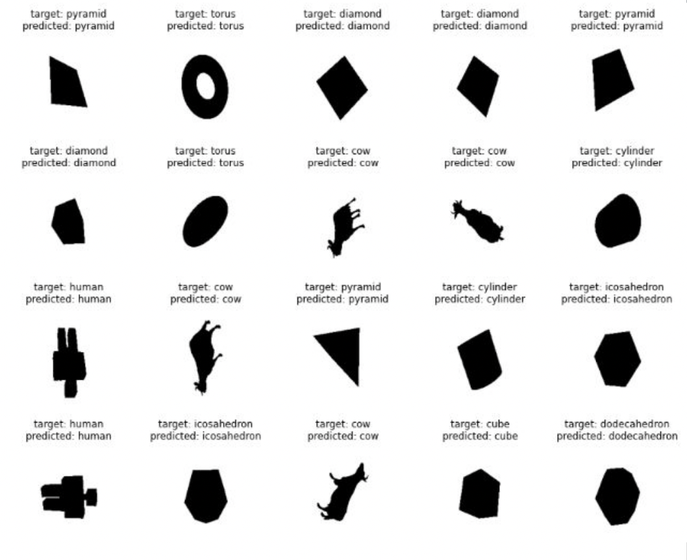
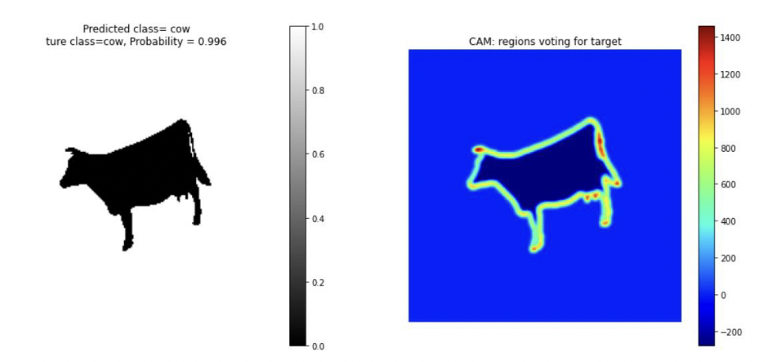

# 3D Object Recognition from 2D Projection

## Overview

In this project, we aim to recognize the shape of a 3D object based on an image of its shadow. The idea was inspired by the video ["The average area of a shadow"](https://www.youtube.com/watch?v=ltLUadnCyi0) by 3Blue1Brown.

This project explores multiple synthetic 3D shapes and uses machine learning models, including logistic regression and convolutional neural networks (CNNs) among others, to classify objects based on their shadows.

## Contributors 
- Liam Farhan (Formerly Mohamad Al Farhan)
- Emil Reiter
- Mahmoud Sharaf

## Project Structure

### Data Generation and Preprocessing
We created a dataset to train the models. The shapes are all synthetic.
- **3D Shapes**: We generated 3D meshes for several shapes, including:
  - Cube
  - Pyramid
  - Tetrahedron
  - Diamond
  - Dodecahedron
  - Icosahedron
  - Torus
  - Cylinder
  - Cow
  - Human

  

- **Projection**: We used perspective projection to create shadows. In this method, the light source is replaced by a viewer, and the objects are projected onto a screen.
- For each object, we generated hundreds of shadow images by randomly orienting the object and projecting it onto the screen.

  

- **Preprocessing**: 
  - Edge detection was applied by comparing pixel values to identify object boundaries and generate images containing only the edges. 
  - Data was compressed and cast into boolean values. To handle memory limitations, all images were resized to 200x200.

### Machine Learning Models

  
  

#### 1. **Multinomial Logistic Regression**
   - **Training**: The model was trained with L2 regularization.
   - **Accuracy**: Achieved a classification accuracy of approximately 60%, which improved slightly (to 62%) when using edge-detected data.

#### 2. **Deep Neural Networks (DNNs)**
   - **Performance**: The model performed better on full shapes than edge-detected data. Using dropout regularization, a learning rate of `0.00001`, and the Adam optimizer, the best results were achieved with a batch size of 40.

#### 3. **Convolutional Neural Networks (CNNs)**
   - CNN architectures, such as VGG and LeNet, were used with varying configurations.
   - **Results**: 
     - The highest accuracy of 97.58% was achieved using a Conv-Conv-Pool architecture.
     - CNNs proved to be superior to DNNs for this task.

  

